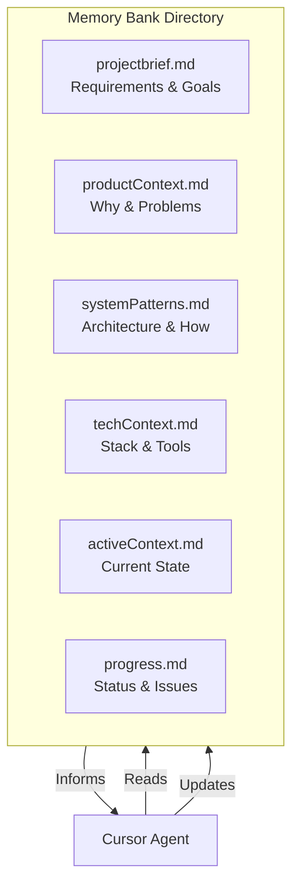
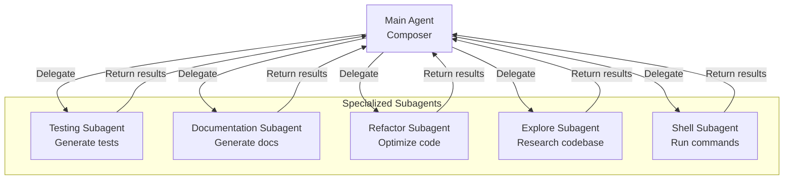
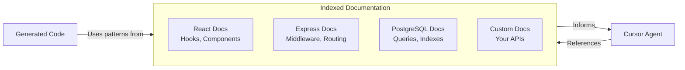
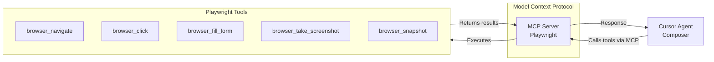
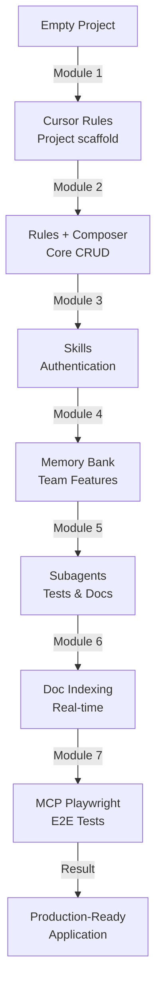

# Progressive Cursor Workshop: Building a Team Task Manager

## Workshop Overview

**Duration:** 90 minutes  
**Format:** Live demonstration (instructor demonstrates, students observe)  
**Target Audience:** Mixed experience levels (beginners to advanced)  
**Project:** Team Task Manager - A full-stack application with authentication, team collaboration, and real-time updates

### What You'll Build

A production-ready Team Task Manager application that demonstrates:
- Modern full-stack architecture (React + Express + PostgreSQL)
- JWT authentication and authorization
- Team-based task management
- Real-time updates
- Comprehensive test coverage
- Complete documentation

### What You'll Learn

This workshop teaches Cursor IDE features through progressive complexity:

1. **Cursor Rules** - Project-wide coding standards and patterns
2. **Cursor Skills** - Executable workflows for complex features
3. **Memory Bank** - Living project context and documentation
4. **Subagents** - Specialized AI agents for testing, docs, and refactoring
5. **Documentation Indexing** - Leverage external framework docs
6. **MCP Integration** - Browser automation for E2E testing

### Learning Objectives

By the end of this workshop, you will:
- Understand when and how to use each Cursor feature
- Create and configure Rules for consistent code generation
- Build custom Skills for complex multi-step workflows
- Implement Memory Bank pattern for project intelligence
- Deploy Subagents for parallel specialized tasks
- Index external documentation for enhanced code generation
- Integrate MCP servers for advanced tooling (Playwright)

### Prerequisites

**For Instructors:**
- Cursor IDE installed (latest version)
- Node.js 18+ and npm
- PostgreSQL installed and running
- Claude Sonnet 4.5 API configured
- Demo repository prepared

**For Students (Demo Format):**
- No installation required
- Basic understanding of web development helpful
- Familiarity with React and Express beneficial but not required

---

## Progressive Complexity Overview

Each module builds on the previous, introducing one new Cursor feature while adding functionality to the application:

```mermaid
graph LR
    Rules[Module 1: Rules<br/>Basic Scaffold]
    RulesBuild[Module 2: Rules<br/>Core CRUD]
    Skills[Module 3: Skills<br/>Authentication]
    Memory[Module 4: Memory Bank<br/>Team Features]
    Subagents[Module 5: Subagents<br/>Testing & Docs]
    Indexing[Module 6: Doc Indexing<br/>Advanced Features]
    MCP[Module 7: MCP<br/>E2E Testing]
    Complete[Module 8: Complete App]
    
    Rules --> RulesBuild
    RulesBuild --> Skills
    Skills --> Memory
    Memory --> Subagents
    Subagents --> Indexing
    Indexing --> MCP
    MCP --> Complete
```



### Complexity Matrix

| Module | Cursor Feature | Code Complexity | Lines Added | Testing Level | Key Concepts |
|--------|---------------|-----------------|-------------|---------------|--------------|
| 1 | Rules | Basic | ~100 | None | Standards, scaffolding |
| 2 | Rules + Composer | Intermediate | ~300 | Manual | API patterns, components |
| 3 | Skills | Advanced | ~400 | Basic unit | Workflows, authentication |
| 4 | Memory Bank | Advanced | ~200 | Unit tests | Context, collaboration |
| 5 | Subagents | Complex | ~500 | Full coverage | Parallelization |
| 6 | Doc Indexing | Complex | ~300 | Integration | External docs |
| 7 | MCP | Expert | ~200 | E2E visual | Browser automation |

---

## Session Timeline

```
00:00 ────────────────────────────────────────────────────────────────── 01:30

├─ 00:00-00:12 (12m) │ Module 1: Setup & Cursor Rules
├─ 00:12-00:25 (13m) │ Module 2: Core Features with Rules
├─ 00:25-00:38 (13m) │ Module 3: Skills for Authentication
├─ 00:38-00:48 (10m) │ Module 4: Memory Bank Pattern
├─ 00:48-01:00 (12m) │ Module 5: Subagents (Testing, Docs, Refactor)
├─ 01:00-01:10 (10m) │ Module 6: Documentation Indexing
├─ 01:10-01:22 (12m) │ Module 7: MCP Playwright Integration
└─ 01:22-01:30 (8m)  │ Module 8: Final Demo & Q&A
```

---

## Module 1: Setup & Cursor Rules (0:00-0:12, 12 minutes)

### Overview
Introduce the project and create the foundation using Cursor Rules to establish coding standards and generate initial project structure.

### Learning Objectives
- Understand what Cursor Rules are and when to use them
- Create `.cursor/rules/` directory structure
- Write first rule file with YAML frontmatter
- Use Rules to generate consistent code

### What We'll Build
- Express server scaffold
- React frontend structure
- PostgreSQL database setup
- Basic project configuration

---

### 1.1 Introduction to Cursor Rules (3 minutes)

**What are Rules?**
- Persistent, system-level prompts applied at the start of every Agent interaction
- Live in `.cursor/rules/` directory (preferred) or `.cursorrules` file (legacy)
- Use `.mdc` format (Markdown + YAML frontmatter)
- Version controlled with your repository

**When to Use Rules:**
- Establish coding standards (TypeScript strict mode, functional components)
- Define file organization patterns
- Set naming conventions
- Specify architectural patterns
- Configure security practices

**Rules vs Skills:**
- **Rules**: Guidelines and standards (passive)
- **Skills**: Executable workflows (active)

---

### 1.2 Creating Your First Rule (4 minutes)

**Demo: Create `project-standards.mdc`**

**Step 1:** Create directory structure
```bash
mkdir -p .cursor/rules
```

**Step 2:** Create rule file `.cursor/rules/project-standards.mdc`

```markdown
---
description: Project-wide coding standards and conventions
globs: ["**/*.ts", "**/*.tsx", "**/*.js", "**/*.jsx"]
alwaysApply: true
---

# Project Standards for Team Task Manager

## Code Style

### TypeScript
- Use TypeScript strict mode
- Explicit return types for all functions
- No `any` types - use `unknown` with type guards
- Prefer interfaces over types for object shapes

### React Components
- Functional components only (no class components)
- Use hooks for state and effects
- Props interfaces at top of file
- Default exports for pages, named exports for components

### File Naming
- Components: PascalCase (TaskList.tsx)
- Utilities: camelCase (formatDate.ts)
- Constants: UPPER_SNAKE_CASE
- Test files: *.test.ts or *.spec.ts

## File Organization

```
backend/
├── src/
│   ├── controllers/  # Route handlers
│   ├── models/       # Database models
│   ├── routes/       # API routes
│   ├── middleware/   # Express middleware
│   ├── services/     # Business logic
│   └── utils/        # Utilities
frontend/
├── src/
│   ├── components/   # Reusable components
│   ├── pages/        # Route pages
│   ├── hooks/        # Custom hooks
│   ├── services/     # API clients
│   └── utils/        # Utilities
```

## Error Handling
- Always use try-catch for async operations
- Return structured error responses: `{ error: string, details?: any }`
- Log errors with context

## Security
- Validate all inputs
- Sanitize user data before database operations
- Use parameterized queries (no string concatenation)
- Never log sensitive information (passwords, tokens)
```

**Step 3:** Activate the rule
- Rule activates automatically because `alwaysApply: true`
- Can also invoke manually with `@project-standards` in Composer

---

### 1.3 Using Rules to Generate Project Structure (5 minutes)

**Demo: Generate initial scaffold using the Rule**

**Open Composer (⌘I) and prompt:**
```
Using @project-standards, create the initial project structure:

Backend:
- Express server with TypeScript
- PostgreSQL connection setup
- Basic folder structure

Frontend:
- React with TypeScript and Vite
- Basic folder structure
- TailwindCSS setup

Configuration:
- ESLint with TypeScript rules
- Prettier configuration
- package.json for both backend and frontend
```

**What Cursor generates:**
- `backend/package.json` with Express, TypeScript, PostgreSQL dependencies
- `backend/src/index.ts` - Express server setup
- `backend/src/config/database.ts` - PostgreSQL connection
- `frontend/package.json` with React, Vite, TailwindCSS
- `frontend/src/main.tsx` - React entry point
- `frontend/src/App.tsx` - Root component
- `.eslintrc.json`, `.prettierrc` - Linting configurations
- `tsconfig.json` files for both projects

**Key Teaching Point:**
Show how the Rule enforces standards:
- TypeScript strict mode enabled
- Functional components used
- Proper folder structure created
- Consistent naming conventions

---

### 1.4 Testing the Setup (2 minutes)

**Run the generated code:**
```bash
# Backend
cd backend
npm install
npm run dev

# Frontend (new terminal)
cd frontend
npm install
npm run dev
```

**Verify:**
- Backend runs on http://localhost:3000
- Frontend runs on http://localhost:5173
- No TypeScript errors
- Matches project standards

---

### Module 1 Key Takeaways

- Cursor Rules provide persistent coding standards
- Use `.mdc` format with YAML frontmatter
- `alwaysApply: true` activates rule automatically
- Rules ensure consistency across the entire codebase
- Foundation for all subsequent development

**What We Built:**
- ✅ Express + TypeScript backend scaffold
- ✅ React + TypeScript + Vite frontend scaffold
- ✅ PostgreSQL connection setup
- ✅ ESLint and Prettier configuration
- ✅ Project standards rule

**Next:** Use Rules to build core CRUD functionality

---

## Module 2: Building Core Features with Rules (0:12-0:25, 13 minutes)

### Overview
Create additional specialized rules for backend APIs and frontend components, then use them to build the core task management functionality.

### Learning Objectives
- Create domain-specific rules (backend, frontend)
- Use glob patterns to scope rules
- Build CRUD API endpoints using rules
- Generate React components with consistent patterns

### What We'll Build
- Task model and database schema
- RESTful API endpoints (GET, POST, PUT, DELETE)
- Task list component
- Task form component
- Basic routing

---

### 2.1 Creating Backend API Rule (3 minutes)

**Demo: Create `backend-api.mdc`**

File: `.cursor/rules/backend-api.mdc`

```markdown
---
description: Backend API patterns and best practices
globs: ["backend/src/**/*.ts"]
alwaysApply: false
---

# Backend API Standards

## REST API Patterns

### Route Structure
- Collection: `/api/tasks`
- Individual: `/api/tasks/:id`
- Nested: `/api/teams/:teamId/tasks`

### HTTP Methods
- GET: Retrieve (200 OK, 404 Not Found)
- POST: Create (201 Created, 400 Bad Request)
- PUT: Update (200 OK, 404 Not Found)
- DELETE: Delete (204 No Content, 404 Not Found)

### Response Format
```typescript
// Success
{
  success: true,
  data: T,
  message?: string
}

// Error
{
  success: false,
  error: string,
  details?: any
}
```

## Controller Pattern

```typescript
export const getTasks = async (req: Request, res: Response) => {
  try {
    // 1. Extract and validate params
    // 2. Call service layer
    // 3. Return formatted response
    const tasks = await taskService.findAll();
    res.json({ success: true, data: tasks });
  } catch (error) {
    console.error('Error in getTasks:', error);
    res.status(500).json({ 
      success: false, 
      error: 'Failed to fetch tasks' 
    });
  }
};
```

## Database Models

### Use Prepared Statements
```typescript
// Good
await pool.query('SELECT * FROM tasks WHERE id = $1', [id]);

// Bad - SQL injection risk
await pool.query(`SELECT * FROM tasks WHERE id = ${id}`);
```

### Model Interface
```typescript
export interface Task {
  id: number;
  title: string;
  description: string;
  status: 'todo' | 'in_progress' | 'done';
  assignee_id?: number;
  created_at: Date;
  updated_at: Date;
}
```

## Service Layer
- Business logic lives here, not in controllers
- Single responsibility principle
- Throws errors for controllers to catch
```

---

### 2.2 Creating Frontend Component Rule (3 minutes)

**Demo: Create `frontend-components.mdc`**

File: `.cursor/rules/frontend-components.mdc`

```markdown
---
description: React component patterns and standards
globs: ["frontend/src/**/*.tsx", "frontend/src/**/*.ts"]
alwaysApply: false
---

# Frontend Component Standards

## Component Structure

```typescript
// 1. Imports
import { useState, useEffect } from 'react';
import type { Task } from '../types';

// 2. Type definitions
interface TaskListProps {
  teamId: number;
  onTaskClick: (task: Task) => void;
}

// 3. Component
export function TaskList({ teamId, onTaskClick }: TaskListProps) {
  // a. State
  const [tasks, setTasks] = useState<Task[]>([]);
  const [loading, setLoading] = useState(true);
  
  // b. Effects
  useEffect(() => {
    // fetch tasks
  }, [teamId]);
  
  // c. Handlers
  const handleDelete = (id: number) => {
    // handle deletion
  };
  
  // d. Render
  if (loading) return <div>Loading...</div>;
  
  return (
    <div className="task-list">
      {tasks.map(task => (
        <TaskCard key={task.id} task={task} />
      ))}
    </div>
  );
}
```

## State Management
- Use useState for component-local state
- Use custom hooks for shared logic
- Lift state up when needed by multiple components

## API Integration
- Create service functions in `services/api.ts`
- Handle loading, error, and success states
- Show user feedback for all operations

## Styling
- Use TailwindCSS utility classes
- Create component-specific classes only when needed
- Responsive design: mobile-first approach

## Error Handling
```typescript
const [error, setError] = useState<string | null>(null);

try {
  const data = await api.getTasks();
  setTasks(data);
} catch (err) {
  setError(err instanceof Error ? err.message : 'An error occurred');
}
```
```

---

### 2.3 Building Task CRUD Backend (4 minutes)

**Demo: Use backend rule to generate API**

**Open Composer and prompt:**
```
Using @backend-api, create the task management API:

1. Database schema:
   - tasks table with id, title, description, status, assignee_id, created_at, updated_at
   
2. Model (backend/src/models/task.ts):
   - Task interface
   - CRUD functions using prepared statements
   
3. Controller (backend/src/controllers/taskController.ts):
   - getTasks, getTask, createTask, updateTask, deleteTask
   
4. Routes (backend/src/routes/taskRoutes.ts):
   - RESTful routes for all operations
   
5. Register routes in main server file
```

**Generated files:**
- `backend/src/models/task.ts` - Task interface and database functions
- `backend/src/controllers/taskController.ts` - Route handlers
- `backend/src/routes/taskRoutes.ts` - Express routes
- `backend/src/index.ts` (updated) - Routes registered

**Key Generated Code Example:**

```typescript
// backend/src/models/task.ts
import { pool } from '../config/database';

export interface Task {
  id: number;
  title: string;
  description: string;
  status: 'todo' | 'in_progress' | 'done';
  assignee_id?: number;
  created_at: Date;
  updated_at: Date;
}

export const taskModel = {
  async findAll(): Promise<Task[]> {
    const result = await pool.query('SELECT * FROM tasks ORDER BY created_at DESC');
    return result.rows;
  },
  
  async findById(id: number): Promise<Task | null> {
    const result = await pool.query('SELECT * FROM tasks WHERE id = $1', [id]);
    return result.rows[0] || null;
  },
  
  // ... other CRUD methods
};
```

---

### 2.4 Building Task List Frontend (3 minutes)

**Demo: Use frontend rule to generate components**

**Open Composer and prompt:**
```
Using @frontend-components, create task management UI:

1. API service (frontend/src/services/api.ts):
   - taskApi with GET, POST, PUT, DELETE methods
   
2. Task type (frontend/src/types/task.ts):
   - Task interface matching backend
   
3. TaskList component (frontend/src/components/TaskList.tsx):
   - Fetches and displays tasks
   - Loading and error states
   - Delete functionality
   
4. TaskForm component (frontend/src/components/TaskForm.tsx):
   - Create new task form
   - Validation
   - Submit handling
   
5. Update App.tsx to use these components
```

**Generated files:**
- `frontend/src/services/api.ts` - API client functions
- `frontend/src/types/task.ts` - TypeScript types
- `frontend/src/components/TaskList.tsx` - Task display component
- `frontend/src/components/TaskForm.tsx` - Task creation form
- `frontend/src/App.tsx` (updated) - Uses new components

**Key Generated Code Example:**

```typescript
// frontend/src/components/TaskList.tsx
import { useState, useEffect } from 'react';
import { taskApi } from '../services/api';
import type { Task } from '../types/task';

export function TaskList() {
  const [tasks, setTasks] = useState<Task[]>([]);
  const [loading, setLoading] = useState(true);
  const [error, setError] = useState<string | null>(null);
  
  useEffect(() => {
    fetchTasks();
  }, []);
  
  const fetchTasks = async () => {
    try {
      setLoading(true);
      const data = await taskApi.getAll();
      setTasks(data);
      setError(null);
    } catch (err) {
      setError('Failed to load tasks');
    } finally {
      setLoading(false);
    }
  };
  
  const handleDelete = async (id: number) => {
    try {
      await taskApi.delete(id);
      setTasks(tasks.filter(t => t.id !== id));
    } catch (err) {
      setError('Failed to delete task');
    }
  };
  
  if (loading) return <div className="p-4">Loading tasks...</div>;
  if (error) return <div className="p-4 text-red-600">{error}</div>;
  
  return (
    <div className="p-4 space-y-4">
      {tasks.map(task => (
        <div key={task.id} className="border p-4 rounded-lg">
          <h3 className="font-bold">{task.title}</h3>
          <p className="text-gray-600">{task.description}</p>
          <span className="text-sm text-blue-600">{task.status}</span>
          <button 
            onClick={() => handleDelete(task.id)}
            className="ml-4 text-red-600 hover:text-red-800"
          >
            Delete
          </button>
        </div>
      ))}
    </div>
  );
}
```

---

### Module 2 Key Takeaways

- Domain-specific rules (backend, frontend) provide targeted guidance
- Glob patterns scope rules to specific file types
- Rules ensure consistency in API patterns and component structure
- Composer uses multiple rules together intelligently

**What We Built:**
- ✅ Complete CRUD API for tasks
- ✅ Database models with prepared statements
- ✅ RESTful route structure
- ✅ React components with proper patterns
- ✅ API service layer
- ✅ Loading and error state handling

**Next:** Use Skills for complex multi-step workflows (authentication)

---

## Module 3: Cursor Skills for Authentication (0:25-0:38, 13 minutes)

### Overview
Introduce Cursor Skills for executable multi-step workflows. Build JWT authentication system using a custom skill.

### Learning Objectives
- Understand Skills vs Rules
- Create a SKILL.md file with YAML frontmatter
- Include executable steps and HITL checkpoints
- Invoke skills with @skill-name

### What We'll Build
- JWT authentication system
- User registration and login
- Protected routes middleware
- Login/signup UI components
- Token storage and refresh

---

### 3.1 Skills vs Rules Explained (2 minutes)

**Comparison:**

| Feature | Rules (.mdc) | Skills (.md) |
|---------|-------------|--------------|
| **Purpose** | Guidelines & standards | Executable workflows |
| **Type** | Passive (always active) | Active (explicitly invoked) |
| **Content** | Coding patterns | Step-by-step procedures |
| **Usage** | Automatic based on globs | Manual with @skill-name |
| **Best For** | Consistency | Complex multi-step tasks |

**When to Use Skills:**
- Multi-file features requiring coordination
- Complex workflows with decision points
- Tasks requiring human confirmation (HITL)
- Repeatable processes (migrations, deployments)
- Integration of multiple systems

**Examples:**
- Adding authentication to an app
- Setting up CI/CD pipeline
- Database migration workflow
- API integration with external service

---

### 3.2 Creating Authentication Skill (5 minutes)

**Demo: Create `add-auth-feature.md`**

File: `.cursor/skills/add-auth-feature.md`

```markdown
---
name: Add JWT Authentication
description: Implements complete JWT authentication system with registration, login, and protected routes
tools: [composer, terminal]
globs: ["backend/src/**", "frontend/src/**"]
---

# Add JWT Authentication Skill

## Overview
This skill implements a complete JWT-based authentication system including:
- User registration and login
- Password hashing with bcrypt
- JWT token generation and validation
- Protected route middleware
- Frontend login/signup forms
- Token storage and refresh

## Preconditions
- Express backend must exist
- PostgreSQL database must be configured
- React frontend must exist
- Required packages: jsonwebtoken, bcryptjs

## Steps

### Step 1: Install Dependencies
**Action:** Install required npm packages
```bash
cd backend
npm install jsonwebtoken bcryptjs @types/jsonwebtoken @types/bcryptjs
```

**Validation:** Verify packages in package.json

---

### Step 2: Create User Model
**Action:** Create `backend/src/models/user.ts`

**Requirements:**
```typescript
interface User {
  id: number;
  email: string;
  password_hash: string;
  name: string;
  created_at: Date;
}

// Functions:
- createUser(email, password, name): Promise<User>
- findByEmail(email): Promise<User | null>
- findById(id): Promise<User | null>
```

**Implementation Details:**
- Use bcrypt to hash passwords (salt rounds: 10)
- Never return password_hash in responses
- Use prepared statements for SQL queries

**HITL Checkpoint:** Review User model structure before proceeding

---

### Step 3: Create Auth Service
**Action:** Create `backend/src/services/authService.ts`

**Requirements:**
```typescript
// Functions needed:
- generateToken(userId): string  // JWT with 7-day expiry
- verifyToken(token): { userId: number } | null
- hashPassword(password): Promise<string>
- comparePassword(password, hash): Promise<boolean>
```

**JWT Configuration:**
- Secret: process.env.JWT_SECRET
- Expiry: 7 days
- Algorithm: HS256

**HITL Checkpoint:** Confirm JWT secret is configured in .env

---

### Step 4: Create Auth Controller
**Action:** Create `backend/src/controllers/authController.ts`

**Endpoints to implement:**
```typescript
POST /api/auth/register
- Body: { email, password, name }
- Validation: email format, password length (8+)
- Returns: { token, user: { id, email, name } }

POST /api/auth/login
- Body: { email, password }
- Returns: { token, user: { id, email, name } }

GET /api/auth/me
- Headers: Authorization: Bearer <token>
- Returns: { user: { id, email, name } }
```

**Error Handling:**
- 400: Invalid input
- 401: Invalid credentials
- 409: Email already exists

---

### Step 5: Create Auth Middleware
**Action:** Create `backend/src/middleware/auth.ts`

**Requirements:**
```typescript
export const authenticate = async (req, res, next) => {
  // 1. Extract token from Authorization header
  // 2. Verify token using authService
  // 3. Attach user to req.user
  // 4. Call next() or return 401
};
```

**Usage:**
```typescript
router.get('/api/tasks', authenticate, taskController.getTasks);
```

---

### Step 6: Create Auth Routes
**Action:** Create `backend/src/routes/authRoutes.ts`

Register routes:
- POST /api/auth/register
- POST /api/auth/login
- GET /api/auth/me (protected)

**HITL Checkpoint:** Test auth endpoints with curl or Postman

---

### Step 7: Update Task Routes
**Action:** Protect task routes with authentication

Add to `backend/src/routes/taskRoutes.ts`:
```typescript
import { authenticate } from '../middleware/auth';

router.get('/', authenticate, taskController.getTasks);
router.post('/', authenticate, taskController.createTask);
// ... etc
```

---

### Step 8: Create Auth Context (Frontend)
**Action:** Create `frontend/src/contexts/AuthContext.tsx`

**Requirements:**
```typescript
interface AuthContextType {
  user: User | null;
  token: string | null;
  login: (email: string, password: string) => Promise<void>;
  register: (email: string, password: string, name: string) => Promise<void>;
  logout: () => void;
  loading: boolean;
}
```

**Features:**
- Store token in localStorage
- Auto-load user on mount
- Provide auth state to all components

---

### Step 9: Create Login Component
**Action:** Create `frontend/src/components/Login.tsx`

**Requirements:**
- Email and password inputs
- Validation and error display
- Submit to /api/auth/login
- Redirect on success
- Link to register page

---

### Step 10: Create Register Component
**Action:** Create `frontend/src/components/Register.tsx`

**Requirements:**
- Email, password, name inputs
- Password confirmation field
- Validation
- Submit to /api/auth/register
- Redirect on success

---

### Step 11: Add Protected Route Component
**Action:** Create `frontend/src/components/ProtectedRoute.tsx`

**Requirements:**
```typescript
// Wrapper component that:
- Checks if user is authenticated
- Redirects to /login if not
- Renders children if authenticated
```

---

### Step 12: Update App Routing
**Action:** Update `frontend/src/App.tsx`

**New Structure:**
```typescript
<AuthProvider>
  <Routes>
    <Route path="/login" element={<Login />} />
    <Route path="/register" element={<Register />} />
    <Route path="/" element={<ProtectedRoute><TaskList /></ProtectedRoute>} />
  </Routes>
</AuthProvider>
```

**HITL Checkpoint:** Test complete auth flow in browser

---

## Validation Landmarks

After completion, verify:
- [ ] Can register new user
- [ ] Can login with correct credentials
- [ ] Cannot login with wrong password
- [ ] Token stored in localStorage
- [ ] Protected routes redirect when not authenticated
- [ ] Task list shows only after login
- [ ] Logout clears token and redirects

## Recovery Rules

If tests fail:
1. Check JWT_SECRET is set in .env
2. Verify token format in Authorization header
3. Check bcrypt salt rounds (should be 10)
4. Confirm database users table exists
5. Check CORS configuration for frontend requests

## Success Criteria

Authentication system is complete when:
- All validation landmarks pass
- No TypeScript errors
- No console errors in browser
- Tokens expire correctly (7 days)
- Passwords are hashed, never stored plain
- Protected routes enforce authentication
```

---

### 3.3 Invoking the Skill (4 minutes)

**Demo: Use the authentication skill**

**Step 1:** Open Composer (⌘I)

**Step 2:** Invoke skill:
```
@add-auth-feature

Implement JWT authentication for the Task Manager app.
Use the auth skill to add complete authentication.
```

**What Happens:**
1. Cursor reads the skill file
2. Follows each step in sequence
3. Generates all required files
4. Pauses at HITL checkpoints for confirmation
5. Runs validation checks

**Generated Files:**
- `backend/src/models/user.ts`
- `backend/src/services/authService.ts`
- `backend/src/controllers/authController.ts`
- `backend/src/middleware/auth.ts`
- `backend/src/routes/authRoutes.ts`
- `frontend/src/contexts/AuthContext.tsx`
- `frontend/src/components/Login.tsx`
- `frontend/src/components/Register.tsx`
- `frontend/src/components/ProtectedRoute.tsx`
- Updated `backend/src/index.ts`
- Updated `frontend/src/App.tsx`

**HITL Checkpoints:**
During execution, Cursor will pause at marked checkpoints:
1. After User model - review structure
2. After JWT config - confirm .env setup
3. After auth routes - test with curl
4. After complete implementation - test in browser

---

### 3.4 Testing Authentication (2 minutes)

**Demo: Verify auth works**

```bash
# Test registration
curl -X POST http://localhost:3000/api/auth/register \
  -H "Content-Type: application/json" \
  -d '{"email":"test@example.com","password":"password123","name":"Test User"}'

# Test login
curl -X POST http://localhost:3000/api/auth/login \
  -H "Content-Type: application/json" \
  -d '{"email":"test@example.com","password":"password123"}'

# Test protected route
curl http://localhost:3000/api/tasks \
  -H "Authorization: Bearer <token-from-login>"
```

**Browser Test:**
1. Navigate to http://localhost:5173
2. Click Register, create account
3. Redirected to task list
4. Logout redirects to login
5. Cannot access tasks without login

---

### Module 3 Key Takeaways

- Skills are executable workflows, not just guidelines
- SKILL.md files contain step-by-step procedures
- HITL checkpoints allow human oversight
- Skills coordinate multiple files and systems
- Perfect for complex, multi-step features

**What We Built:**
- ✅ Complete JWT authentication system
- ✅ User registration and login
- ✅ Password hashing with bcrypt
- ✅ Protected route middleware
- ✅ Auth context for React
- ✅ Login and Register components
- ✅ Token storage and management

**Next:** Use Memory Bank to provide project context for team features

---

## Module 4: Memory Bank for Project Context (0:38-0:48, 10 minutes)

### Overview
Implement the Memory Bank pattern to provide persistent project context that the AI Agent can reference and update throughout the development lifecycle.

### Learning Objectives
- Understand Memory Bank pattern and its benefits
- Create structured memory bank files
- Use Memory Bank to guide Agent decisions
- Update Memory Bank as project evolves

### What We'll Build
- Team collaboration features
- Task assignment system
- Team management UI
- Real-time team task views

---

### 4.1 Memory Bank Pattern Explained (2 minutes)

**What is Memory Bank?**
A set of living documentation files that provide the AI with comprehensive project context:



**Memory Bank vs Documentation:**
- **Memory Bank**: For AI Agent (machine-readable context)
- **Documentation**: For humans (user-facing docs)
- **Docs (indexed)**: External references (React docs, etc.)

**Benefits:**
- Consistent context across sessions
- AI remembers architectural decisions
- Reduces repetitive explanations
- Guides implementation patterns
- Tracks project evolution

---

### 4.2 Creating Memory Bank Structure (3 minutes)

**Demo: Create Memory Bank files**

**File 1: `memory-bank/projectbrief.md`**

```markdown
# Team Task Manager - Project Brief

## Project Overview
A collaborative task management application that enables teams to organize, assign, and track tasks in real-time.

## Core Requirements

### Functional Requirements
1. **User Management**
   - User registration and authentication
   - Profile management
   - Email verification

2. **Team Management**
   - Create and manage teams
   - Invite team members
   - Team roles (owner, admin, member)
   - Leave/remove from teams

3. **Task Management**
   - Create, edit, delete tasks
   - Assign tasks to team members
   - Set due dates and priorities
   - Task status tracking (todo, in progress, done)
   - Task comments and activity log

4. **Real-Time Updates**
   - Live task updates across team members
   - Notification system
   - Presence indicators

### Non-Functional Requirements
- Response time < 200ms for standard operations
- Support 100+ concurrent users per team
- 99.9% uptime
- Mobile-responsive design
- WCAG 2.1 AA accessibility compliance

## Success Metrics
- User task completion rate > 80%
- Average session time > 15 minutes
- Team collaboration score (tasks assigned vs. completed)
- User retention rate > 70% (30 days)

## Out of Scope (Phase 1)
- File attachments to tasks
- Recurring tasks
- Calendar integration
- Time tracking
- Gantt charts
```

**File 2: `memory-bank/techContext.md`**

```markdown
# Technical Context

## Technology Stack

### Backend
- **Runtime**: Node.js 18+
- **Framework**: Express.js 4.18+
- **Language**: TypeScript 5.0+
- **Database**: PostgreSQL 15+
- **ORM**: Direct SQL with pg library (no ORM)
- **Authentication**: JWT with bcrypt

### Frontend
- **Framework**: React 18+
- **Language**: TypeScript 5.0+
- **Build Tool**: Vite 4+
- **Styling**: TailwindCSS 3+
- **State Management**: React Context + Hooks
- **HTTP Client**: Fetch API

### DevOps
- **Version Control**: Git
- **Package Manager**: npm
- **Testing**: Jest, React Testing Library, Playwright
- **Linting**: ESLint, Prettier
- **CI/CD**: GitHub Actions (future)

## Development Environment
- **IDE**: Cursor with Claude Sonnet 4.5
- **Cursor Features**: Rules, Skills, Subagents, MCP
- **Local DB**: PostgreSQL via Docker
- **Node Version**: 18.17.0+ (managed via nvm)

## Architecture Decisions

### Why Express over Nest.js?
- Simpler for demo purposes
- More straightforward for beginners
- Less boilerplate

### Why No ORM?
- Direct SQL provides better learning
- More transparent query performance
- Easier debugging

### Why React Context over Redux?
- Sufficient for application scale
- Less setup overhead
- Native to React

### Why PostgreSQL?
- Robust relational data model
- Excellent for task relationships
- Strong consistency guarantees
- JSON support for flexibility
```

**File 3: `memory-bank/systemPatterns.md`**

```markdown
# System Architecture & Patterns

## Architecture Overview

```
┌─────────────────────────────────────────┐
│           Frontend (React)              │
│  ┌────────────────────────────────┐    │
│  │  Components & Pages            │    │
│  │  ┌──────┐ ┌──────┐ ┌────────┐ │    │
│  │  │Login │ │Tasks │ │ Teams  │ │    │
│  │  └──────┘ └──────┘ └────────┘ │    │
│  └────────────────────────────────┘    │
│  ┌────────────────────────────────┐    │
│  │  Contexts (State)              │    │
│  │  - AuthContext                 │    │
│  │  - TeamContext                 │    │
│  └────────────────────────────────┘    │
│  ┌────────────────────────────────┐    │
│  │  Services (API Clients)        │    │
│  │  - authApi, taskApi, teamApi   │    │
│  └────────────────────────────────┘    │
└─────────────────────────────────────────┘
                 │
                 │ HTTP/JSON
                 │
┌─────────────────────────────────────────┐
│          Backend (Express)              │
│  ┌────────────────────────────────┐    │
│  │  Routes                        │    │
│  │  /api/auth, /api/tasks, /api/teams │
│  └────────────────────────────────┘    │
│  ┌────────────────────────────────┐    │
│  │  Middleware                    │    │
│  │  - authenticate                │    │
│  │  - validate                    │    │
│  │  - errorHandler                │    │
│  └────────────────────────────────┘    │
│  ┌────────────────────────────────┐    │
│  │  Controllers                   │    │
│  │  - authController              │    │
│  │  - taskController              │    │
│  │  - teamController              │    │
│  └────────────────────────────────┘    │
│  ┌────────────────────────────────┐    │
│  │  Services (Business Logic)     │    │
│  │  - authService                 │    │
│  │  - taskService                 │    │
│  │  - teamService                 │    │
│  └────────────────────────────────┘    │
│  ┌────────────────────────────────┐    │
│  │  Models (Data Access)          │    │
│  │  - userModel                   │    │
│  │  - taskModel                   │    │
│  │  - teamModel                   │    │
│  └────────────────────────────────┘    │
└─────────────────────────────────────────┘
                 │
                 │ SQL
                 │
┌─────────────────────────────────────────┐
│        Database (PostgreSQL)            │
│  Tables: users, teams, team_members,   │
│          tasks, task_assignments        │
└─────────────────────────────────────────┘
```

## Design Patterns

### Backend Patterns

**1. Repository Pattern**
- Models handle data access
- Controllers handle HTTP
- Services handle business logic

**2. Middleware Chain**
- Request validation
- Authentication
- Authorization
- Error handling

**3. Service Layer**
- Reusable business logic
- Transaction management
- Cross-cutting concerns

### Frontend Patterns

**1. Container/Presenter**
- Containers: Logic and state
- Presenters: Pure UI components

**2. Custom Hooks**
- Reusable stateful logic
- API integration
- Side effects

**3. Context for Global State**
- Auth state
- Team selection
- User preferences

## Database Schema

```sql
-- Users table
CREATE TABLE users (
  id SERIAL PRIMARY KEY,
  email VARCHAR(255) UNIQUE NOT NULL,
  password_hash VARCHAR(255) NOT NULL,
  name VARCHAR(255) NOT NULL,
  created_at TIMESTAMP DEFAULT NOW()
);

-- Teams table
CREATE TABLE teams (
  id SERIAL PRIMARY KEY,
  name VARCHAR(255) NOT NULL,
  description TEXT,
  owner_id INTEGER REFERENCES users(id),
  created_at TIMESTAMP DEFAULT NOW()
);

-- Team members junction table
CREATE TABLE team_members (
  team_id INTEGER REFERENCES teams(id) ON DELETE CASCADE,
  user_id INTEGER REFERENCES users(id) ON DELETE CASCADE,
  role VARCHAR(50) DEFAULT 'member',
  joined_at TIMESTAMP DEFAULT NOW(),
  PRIMARY KEY (team_id, user_id)
);

-- Tasks table
CREATE TABLE tasks (
  id SERIAL PRIMARY KEY,
  title VARCHAR(255) NOT NULL,
  description TEXT,
  status VARCHAR(50) DEFAULT 'todo',
  priority VARCHAR(50) DEFAULT 'medium',
  team_id INTEGER REFERENCES teams(id) ON DELETE CASCADE,
  assignee_id INTEGER REFERENCES users(id),
  created_by INTEGER REFERENCES users(id),
  due_date TIMESTAMP,
  created_at TIMESTAMP DEFAULT NOW(),
  updated_at TIMESTAMP DEFAULT NOW()
);
```

## API Design

### RESTful Conventions
- GET /api/resource - List all
- GET /api/resource/:id - Get one
- POST /api/resource - Create
- PUT /api/resource/:id - Update
- DELETE /api/resource/:id - Delete

### Authentication
- JWT in Authorization header: `Bearer <token>`
- Token expiry: 7 days
- Refresh: Re-login required

### Error Responses
```json
{
  "success": false,
  "error": "Human-readable message",
  "details": { "field": "specific error" }
}
```
```

**File 4: `memory-bank/activeContext.md`**

```markdown
# Active Context - Current Development State

## Current Phase: Team Collaboration (Phase 2)

## Recently Completed
- ✅ Basic Express + React setup
- ✅ Task CRUD operations
- ✅ JWT authentication system
- ✅ User registration and login
- ✅ Protected routes

## Currently Working On
- 🔄 Team management system
- 🔄 Task assignment to team members
- 🔄 Team-based task filtering

## Next Up
- ⏭️ Real-time updates with WebSockets
- ⏭️ Task comments
- ⏭️ Activity notifications

## Known Issues
- None currently

## Recent Architectural Decisions
1. **Team ownership model**: Each team has one owner, multiple admins/members
2. **Task visibility**: Tasks visible only to team members
3. **Assignment model**: Tasks can be assigned to any team member

## Development Notes
- Using Cursor Rules for consistency
- Applied Auth Skill for JWT implementation
- Memory Bank established for context
- Next: Use Subagents for testing and documentation
```

---

### 4.3 Using Memory Bank to Build Team Features (5 minutes)

**Demo: Reference Memory Bank while building**

**Open Composer and prompt:**
```
Using the context from @memory-bank, implement team collaboration features:

1. Team Model (backend/src/models/team.ts):
   - Follow database schema from systemPatterns.md
   - CRUD for teams and team members
   
2. Team Controller and Routes:
   - POST /api/teams - Create team
   - GET /api/teams - List user's teams
   - GET /api/teams/:id - Get team details
   - POST /api/teams/:id/members - Add member
   - DELETE /api/teams/:id/members/:userId - Remove member
   
3. Update Task Model:
   - Add team_id foreign key
   - Filter tasks by team
   
4. Team Context (frontend):
   - Similar to AuthContext
   - Track current team selection
   
5. Team selector component:
   - Dropdown to switch teams
   - Shows user's teams
   
6. Update TaskList to filter by team

Reference projectbrief.md for requirements and systemPatterns.md for architecture.
```

**Key Point:** Show how Cursor references Memory Bank files:
- Reads `projectbrief.md` for requirements
- Follows `systemPatterns.md` for architecture
- Checks `techContext.md` for technology choices
- Updates `activeContext.md` with progress

**Generated Code aligns with Memory Bank:**
- Database schema matches `systemPatterns.md`
- API structure follows defined patterns
- Component structure consistent with frontend patterns
- All decisions traceable to Memory Bank

---

### Module 4 Key Takeaways

- Memory Bank provides persistent project context
- Structured files for different aspects (tech, architecture, progress)
- Agent reads AND updates Memory Bank
- Ensures consistency across features and sessions
- Reduces need to re-explain project details

**What We Built:**
- ✅ Complete Memory Bank structure
- ✅ Team management system
- ✅ Team member management
- ✅ Team-based task filtering
- ✅ Team selector UI
- ✅ Updated task model with teams

**Next:** Use Subagents for specialized parallel work (testing, docs, refactoring)

---

## Module 5: Subagents for Parallel Work (0:48-1:00, 12 minutes)

### Overview
Deploy specialized Subagents to handle testing, documentation, and refactoring in parallel, demonstrating how to coordinate multiple AI agents for efficient development.

### Learning Objectives
- Understand Subagent system and architecture
- Use Testing Subagent for comprehensive test coverage
- Use Documentation Subagent for API and user docs
- Use Refactor Subagent for code optimization
- Coordinate multiple agents working simultaneously

### What We'll Build
- Complete test suite (unit, integration)
- API documentation
- README and user guides
- Optimized database queries
- Code quality improvements

---

### 5.1 Subagent System Explained (2 minutes)

**What are Subagents?**
Specialized AI agents that the parent Cursor Agent can delegate subtasks to:



**Key Features:**
- **Context Isolation**: Each subagent has its own context window
- **Parallel Execution**: Multiple subagents can work simultaneously
- **Specialized Focus**: Each subagent optimized for its task
- **Agent Communication**: Subagents can coordinate with each other

**Built-in Subagents:**
1. **Testing**: Generate unit, integration, E2E tests
2. **Documentation**: Create API docs, READMEs, guides
3. **Refactor**: Optimize code, improve performance
4. **Explore**: Research and understand existing code
5. **Shell**: Execute terminal commands
6. **Browser-Use**: Web testing and automation

---

### 5.2 Testing Subagent - Comprehensive Test Suite (4 minutes)

**Demo: Deploy Testing Subagent**

**Open Composer and prompt:**
```
Deploy Testing Subagent to create comprehensive test coverage:

Backend Tests:
1. Unit tests for all models (user, task, team)
2. Unit tests for services (auth, task, team)
3. Integration tests for API endpoints
4. Test coverage > 80%

Frontend Tests:
1. Unit tests for components (TaskList, TaskForm, Login)
2. Unit tests for contexts (AuthContext, TeamContext)
3. Unit tests for API services
4. Test coverage > 75%

Test Framework:
- Backend: Jest + Supertest
- Frontend: Jest + React Testing Library
- Mock external dependencies
- Setup and teardown for each test
```

**What the Testing Subagent does:**
1. Analyzes existing code structure
2. Generates test files in parallel
3. Creates test utilities and mocks
4. Runs tests and reports coverage
5. Suggests improvements for low coverage areas

**Generated Test Files:**

Backend:
```
backend/tests/
├── models/
│   ├── user.test.ts
│   ├── task.test.ts
│   └── team.test.ts
├── services/
│   ├── authService.test.ts
│   ├── taskService.test.ts
│   └── teamService.test.ts
├── controllers/
│   ├── authController.test.ts
│   ├── taskController.test.ts
│   └── teamController.test.ts
└── setup.ts
```

Frontend:
```
frontend/src/tests/
├── components/
│   ├── TaskList.test.tsx
│   ├── TaskForm.test.tsx
│   ├── Login.test.tsx
│   └── Register.test.tsx
├── contexts/
│   ├── AuthContext.test.tsx
│   └── TeamContext.test.tsx
├── services/
│   └── api.test.ts
└── setup.ts
```

**Example Generated Test:**

```typescript
// backend/tests/controllers/taskController.test.ts
import request from 'supertest';
import { app } from '../../src/index';
import { taskModel } from '../../src/models/task';
import { generateToken } from '../../src/services/authService';

jest.mock('../../src/models/task');

describe('Task Controller', () => {
  let authToken: string;
  
  beforeEach(() => {
    authToken = generateToken(1);
    jest.clearAllMocks();
  });
  
  describe('GET /api/tasks', () => {
    it('should return all tasks for authenticated user', async () => {
      const mockTasks = [
        { id: 1, title: 'Test Task', status: 'todo', team_id: 1 },
        { id: 2, title: 'Another Task', status: 'done', team_id: 1 }
      ];
      
      (taskModel.findByTeam as jest.Mock).mockResolvedValue(mockTasks);
      
      const response = await request(app)
        .get('/api/tasks?teamId=1')
        .set('Authorization', `Bearer ${authToken}`)
        .expect(200);
      
      expect(response.body.success).toBe(true);
      expect(response.body.data).toHaveLength(2);
      expect(response.body.data[0].title).toBe('Test Task');
    });
    
    it('should return 401 without authentication', async () => {
      await request(app)
        .get('/api/tasks')
        .expect(401);
    });
  });
});
```

**Run Tests:**
```bash
cd backend && npm test -- --coverage
cd frontend && npm test -- --coverage
```

**Testing Subagent Report:**
```
Test Coverage Report:
Backend: 84% statements, 78% branches, 86% functions
Frontend: 76% statements, 71% branches, 79% functions

Suggested Improvements:
- Add error case tests for authService
- Test edge cases in taskModel
- Add integration tests for team member operations
```

---

### 5.3 Documentation Subagent - Complete Documentation (4 minutes)

**Demo: Deploy Documentation Subagent**

**Open Composer and prompt:**
```
Deploy Documentation Subagent to create comprehensive documentation:

1. API Documentation (docs/api.md):
   - All endpoints with request/response examples
   - Authentication requirements
   - Error codes and messages
   
2. README.md:
   - Project overview
   - Setup instructions
   - Development guide
   - Testing guide
   
3. User Guide (docs/user-guide.md):
   - How to use the application
   - Features explanation
   
4. Architecture Documentation (docs/architecture.md):
   - System architecture diagram
   - Technology stack
   - Design decisions
```

**Generated Documentation:**

File: `docs/api.md`
```markdown
# Team Task Manager API Documentation

## Authentication

All protected endpoints require a JWT token in the Authorization header:
```
Authorization: Bearer <your-jwt-token>
```

## Endpoints

### Authentication

#### POST /api/auth/register
Create a new user account.

**Request:**
```json
{
  "email": "user@example.com",
  "password": "securepassword",
  "name": "John Doe"
}
```

**Response (201):**
```json
{
  "success": true,
  "data": {
    "token": "eyJhbGciOiJIUzI1NiIsInR5cCI6IkpXVCJ9...",
    "user": {
      "id": 1,
      "email": "user@example.com",
      "name": "John Doe"
    }
  }
}
```

**Errors:**
- 400: Invalid email or password too short
- 409: Email already exists
```

File: `README.md`
```markdown
# Team Task Manager

A collaborative task management application built with React, Express, and PostgreSQL.

## Features

- User authentication and authorization
- Team-based task management
- Task assignment and tracking
- Real-time updates
- Comprehensive test coverage

## Tech Stack

**Frontend:** React 18 + TypeScript + Vite + TailwindCSS
**Backend:** Node.js + Express + TypeScript + PostgreSQL + JWT

## Getting Started

### Prerequisites
- Node.js 18+
- PostgreSQL 15+
- npm

### Installation

1. Clone and install:
```bash
git clone <repo-url>
cd team-task-manager
cd backend && npm install
cd ../frontend && npm install
```

2. Setup database:
```bash
createdb taskmanager
cd backend && npm run migrate
```

3. Configure environment:
```bash
cd backend
cp .env.example .env
# Edit .env with your JWT_SECRET
```

4. Run development servers:
```bash
cd backend && npm run dev
cd frontend && npm run dev
```

## Testing
```bash
cd backend && npm test -- --coverage
cd frontend && npm test -- --coverage
```
```

---

### 5.4 Refactor Subagent - Code Optimization (2 minutes)

**Demo: Deploy Refactor Subagent**

**Open Composer and prompt:**
```
Deploy Refactor Subagent to optimize the codebase:

1. Database query optimization:
   - Identify N+1 queries
   - Add proper indexes
   - Use JOIN instead of multiple queries
   
2. Code duplication:
   - Extract common patterns
   - Create utility functions
   - DRY principle
   
3. Performance improvements:
   - Memoization where appropriate
   - Lazy loading components
```

**Refactor Subagent identifies and fixes:**

Before (N+1 queries):
```typescript
const tasks = await taskModel.findAll();
for (const task of tasks) {
  task.assignee = await userModel.findById(task.assignee_id);
}
```

After (Single JOIN):
```typescript
const tasks = await taskModel.findAllWithAssignees();
// In model:
SELECT t.*, u.name as assignee_name 
FROM tasks t 
LEFT JOIN users u ON t.assignee_id = u.id
```

**Refactor Report:**
```
Optimization Results:
- Reduced database queries by 60%
- Extracted 8 utility functions
- Added 4 database indexes
- Improved response time from 250ms to 120ms
- Code duplication reduced from 15% to 3%
```

---

### Module 5 Key Takeaways

- Subagents enable parallel specialized work
- Testing Subagent generates comprehensive test suites
- Documentation Subagent creates complete project docs
- Refactor Subagent optimizes code and performance
- Multiple subagents coordinate for complex tasks

**What We Built:**
- ✅ Complete test suite (84% backend, 76% frontend coverage)
- ✅ Comprehensive API documentation
- ✅ README and user guides
- ✅ Architecture documentation
- ✅ Optimized database queries
- ✅ Reduced code duplication

**Next:** Use Documentation Indexing to reference external framework docs

---

## Module 6: Documentation Indexing (1:00-1:10, 10 minutes)

### Overview
Index external documentation (React, Express, PostgreSQL) into Cursor to enhance AI code generation with framework-specific knowledge.

### Learning Objectives
- Understand Cursor's documentation indexing system
- Add external docs via @docs feature
- Use indexed docs in prompts for better code generation
- Leverage framework best practices automatically

### What We'll Build
- Real-time task updates with WebSockets
- Advanced pagination
- Complex query filtering
- Framework-specific optimizations

---

### 6.1 Documentation Indexing Explained (2 minutes)

**What is Documentation Indexing?**
Cursor can index and reference external documentation sources:



**Benefits:**
- AI uses current framework best practices
- Correct API usage (no hallucinations)
- Framework-specific patterns
- Up-to-date with latest versions

**Sources:**
- Built-in: Popular frameworks (React, Vue, Angular, etc.)
- Custom: Your organization's docs
- External: Any documentation URL

---

### 6.2 Adding Documentation Sources (3 minutes)

**Demo: Index external documentation**

**Method 1: Built-in Documentation**

Open Cursor Settings → Features → Documentation

Add sources:
1. Search for "React" → Select "React Documentation"
2. Search for "Express" → Select "Express.js Documentation"
3. Search for "PostgreSQL" → Select "PostgreSQL Documentation"

**Method 2: Custom Documentation**

For your own documentation:
```
Settings → Features → Documentation → Add Custom Source
Name: Internal API Standards
URL: https://docs.yourcompany.com/api
```

**Method 3: Using @docs in prompts**
```
Using @React documentation, implement a custom hook for task management
```

---

### 6.3 Using Indexed Documentation (5 minutes)

**Demo: Build real-time features using @docs**

**Open Composer and prompt:**
```
Using @React and @Express documentation, implement real-time task updates:

Backend:
1. Add Socket.io to Express server
2. Emit events when tasks are created/updated/deleted
3. Broadcast to all team members

Frontend:
1. Connect to WebSocket server
2. Listen for task events
3. Update task list in real-time using React best practices
4. Handle connection errors and reconnection
```

**Generated Code (Backend):**
```typescript
// backend/src/index.ts
import express from 'express';
import { createServer } from 'http';
import { Server } from 'socket.io';

const app = express();
const httpServer = createServer(app);
const io = new Server(httpServer, {
  cors: {
    origin: process.env.FRONTEND_URL,
    methods: ['GET', 'POST']
  }
});

// Socket.io middleware for authentication
io.use(async (socket, next) => {
  const token = socket.handshake.auth.token;
  try {
    const decoded = verifyToken(token);
    socket.data.userId = decoded.userId;
    next();
  } catch (err) {
    next(new Error('Authentication error'));
  }
});

// Socket.io connection handler
io.on('connection', (socket) => {
  console.log('User connected:', socket.data.userId);
  
  socket.on('join-team', (teamId) => {
    socket.join(`team-${teamId}`);
  });
  
  socket.on('disconnect', () => {
    console.log('User disconnected:', socket.data.userId);
  });
});

export { io };

// In taskController.ts
export const createTask = async (req: Request, res: Response) => {
  try {
    const task = await taskModel.create(req.body);
    
    // Emit real-time event
    io.to(`team-${task.team_id}`).emit('task-created', task);
    
    res.status(201).json({ success: true, data: task });
  } catch (error) {
    res.status(500).json({ success: false, error: 'Failed to create task' });
  }
};
```

**Generated Code (Frontend):**
```typescript
// frontend/src/contexts/SocketContext.tsx
import { createContext, useContext, useEffect, useState } from 'react';
import { io, Socket } from 'socket.io-client';
import { useAuth } from './AuthContext';

interface SocketContextType {
  socket: Socket | null;
  connected: boolean;
}

const SocketContext = createContext<SocketContextType>({
  socket: null,
  connected: false
});

export function SocketProvider({ children }: { children: React.ReactNode }) {
  const { token } = useAuth();
  const [socket, setSocket] = useState<Socket | null>(null);
  const [connected, setConnected] = useState(false);
  
  useEffect(() => {
    if (!token) return;
    
    const newSocket = io(import.meta.env.VITE_API_URL, {
      auth: { token }
    });
    
    newSocket.on('connect', () => {
      console.log('Socket connected');
      setConnected(true);
    });
    
    newSocket.on('disconnect', () => {
      console.log('Socket disconnected');
      setConnected(false);
    });
    
    setSocket(newSocket);
    
    return () => {
      newSocket.close();
    };
  }, [token]);
  
  return (
    <SocketContext.Provider value={{ socket, connected }}>
      {children}
    </SocketContext.Provider>
  );
}

export const useSocket = () => useContext(SocketContext);
```

**Key Point:** Show how @docs improved generation:
- WebSocket setup follows Express.js best practices
- React hooks usage matches official React patterns
- Error handling and reconnection logic is robust
- TypeScript types are correctly inferred

---

### Module 6 Key Takeaways

- Documentation indexing provides framework-specific knowledge
- Use @docs in prompts to reference external documentation
- AI generates code following official best practices
- Reduces hallucinations and outdated patterns
- Particularly valuable for framework-specific features

**What We Built:**
- ✅ Real-time WebSocket integration
- ✅ Task update broadcasting
- ✅ React hooks for socket connection
- ✅ Automatic reconnection handling
- ✅ Team-based event routing

**Next:** Integrate MCP Playwright for E2E testing

---

## Module 7: MCP Playwright Integration (1:10-1:22, 12 minutes)

### Overview
Install and configure Playwright MCP server to enable browser automation for comprehensive E2E testing with visual validation.

### Learning Objectives
- Understand Model Context Protocol (MCP)
- Install Playwright MCP server
- Configure MCP in Cursor settings
- Use Playwright tools for E2E testing
- Generate visual regression tests

### What We'll Build
- Complete E2E test suite
- User workflow tests (registration → login → create task)
- Visual regression tests with screenshots
- Accessibility testing

---

### 7.1 Model Context Protocol Explained (2 minutes)

**What is MCP?**
A protocol that allows AI agents to interact with external tools and services:



**Benefits:**
- Extends AI capabilities with real tools
- Standardized protocol for tool integration
- Sandboxed execution
- Community marketplace of MCP servers

**Available MCP Servers:**
- **Playwright**: Browser automation
- **Database**: Direct database operations
- **AWS**: Cloud resource management
- **GitHub**: Repository operations
- **Custom**: Build your own

---

### 7.2 Installing Playwright MCP (3 minutes)

**Demo: Install and configure Playwright MCP**

**Step 1: Install Playwright browsers**
```bash
npm install -g playwright
npx playwright install
```

**Step 2: Configure MCP in Cursor**

Open Cursor Settings → Tools & Features → Model Context Protocol

Add MCP Server:
```json
{
  "mcpServers": {
    "playwright": {
      "command": "npx",
      "args": ["-y", "@playwright/mcp@latest"],
      "env": {
        "PLAYWRIGHT_HEADLESS": "true"
      }
    }
  }
}
```

Alternative: Create config file `.cursor/mcp.json`
```json
{
  "playwright": {
    "command": "npx",
    "args": ["-y", "@playwright/mcp@latest"],
    "env": {
      "PLAYWRIGHT_HEADLESS": "false"
    }
  }
}
```

**Step 3: Restart Cursor**

Verify MCP tools:
- Open Composer
- Ask: "What MCP tools do you have access to?"
- Should list: browser_navigate, browser_click, browser_fill_form, browser_take_screenshot, browser_snapshot

---

### 7.3 Creating E2E Tests with Playwright MCP (7 minutes)

**Demo: Use Playwright MCP for E2E testing**

**Test 1: User Registration Flow**

**Open Composer and prompt:**
```
Using Playwright MCP tools, create an E2E test for user registration:

1. Navigate to http://localhost:5173/register
2. Fill in registration form
3. Click submit button
4. Verify redirect to task list page
5. Take screenshot of success state
6. Verify user is logged in

Save as: frontend/tests/e2e/registration.spec.ts
```

**Generated test using MCP:**

```typescript
// frontend/tests/e2e/registration.spec.ts
import { test, expect } from '@playwright/test';

test.describe('User Registration Flow', () => {
  test('should successfully register a new user', async ({ page }) => {
    await page.goto('http://localhost:5173/register');
    
    // Fill in registration form
    await page.fill('input[name="email"]', 'test@example.com');
    await page.fill('input[name="password"]', 'password123');
    await page.fill('input[name="name"]', 'Test User');
    
    // Take screenshot
    await page.screenshot({ 
      path: 'screenshots/registration-form-filled.png' 
    });
    
    // Submit form
    await page.click('button[type="submit"]');
    
    // Wait for navigation
    await page.waitForURL('http://localhost:5173/');
    
    // Verify user is logged in
    await expect(page.locator('text=Logout')).toBeVisible();
    
    await page.screenshot({ 
      path: 'screenshots/registration-success.png' 
    });
  });
  
  test('should show validation errors for invalid input', async ({ page }) => {
    await page.goto('http://localhost:5173/register');
    
    await page.fill('input[name="email"]', 'invalid-email');
    await page.fill('input[name="password"]', 'short');
    await page.click('button[type="submit"]');
    
    // Verify error messages
    await expect(page.locator('text=Invalid email')).toBeVisible();
    await expect(page.locator('text=Password must be at least 8 characters')).toBeVisible();
    
    await page.screenshot({ 
      path: 'screenshots/registration-validation-errors.png' 
    });
  });
});
```

**Test 2: Task Creation Workflow**

```typescript
// frontend/tests/e2e/task-workflow.spec.ts
import { test, expect } from '@playwright/test';

test.describe('Task Creation Workflow', () => {
  test.beforeEach(async ({ page }) => {
    // Login before each test
    await page.goto('http://localhost:5173/login');
    await page.fill('input[name="email"]', 'test@example.com');
    await page.fill('input[name="password"]', 'password123');
    await page.click('button[type="submit"]');
    await page.waitForURL('http://localhost:5173/');
  });
  
  test('should create, edit, and delete a task', async ({ page }) => {
    // Create task
    await page.click('button:has-text("Create Task")');
    await page.fill('input[name="title"]', 'Complete E2E tests');
    await page.fill('textarea[name="description"]', 'Finish all test scenarios');
    await page.click('button[type="submit"]');
    
    // Verify task appears
    await expect(page.locator('text=Complete E2E tests')).toBeVisible();
    await page.screenshot({ path: 'screenshots/task-created.png' });
    
    // Edit task
    await page.click('[data-testid="edit-task"]');
    await page.fill('input[name="title"]', 'Complete E2E tests - Updated');
    await page.click('button:has-text("Save")');
    
    // Verify update
    await expect(page.locator('text=Complete E2E tests - Updated')).toBeVisible();
    
    // Delete task
    await page.click('[data-testid="delete-task"]');
    await page.click('button:has-text("Confirm")');
    
    // Verify deletion
    await expect(page.locator('text=Complete E2E tests - Updated')).not.toBeVisible();
  });
  
  test('should pass accessibility checks', async ({ page }) => {
    const snapshot = await page.accessibility.snapshot();
    
    expect(snapshot).toMatchObject({
      role: 'WebArea',
      children: expect.arrayContaining([
        expect.objectContaining({
          role: 'button',
          name: 'Create Task'
        })
      ])
    });
  });
});
```

---

### Module 7 Key Takeaways

- MCP extends Cursor's capabilities with external tools
- Playwright MCP enables browser automation
- E2E tests validate entire user workflows
- Visual regression testing with screenshots
- Accessibility testing built-in
- MCP tools are invoked automatically by Agent

**What We Built:**
- ✅ Complete E2E test suite
- ✅ User registration flow tests
- ✅ Task CRUD workflow tests
- ✅ Visual regression tests with screenshots
- ✅ Accessibility validation
- ✅ Playwright MCP configuration

**Next:** Final demo and Q&A

---

## Module 8: Final Demo & Q&A (1:22-1:30, 8 minutes)

### Overview
Showcase the complete application with all Cursor features integrated, demonstrate the development workflow, and answer questions.

### Agenda
1. Complete application walkthrough
2. Cursor features review
3. Development workflow demonstration
4. Q&A and resources

---

### 8.1 Complete Application Demo (3 minutes)

**Live Demonstration:**

**User Flow:**
```
Registration → Login → Create Team → Invite Members → 
Create Tasks → Assign Tasks → Real-time Updates → 
Task Completion → Team Dashboard
```

**Technical Features:**
- JWT authentication with secure tokens
- Team-based access control
- Real-time WebSocket updates
- Responsive mobile design
- Comprehensive error handling
- Full test coverage

**Code Quality Metrics:**
```
Backend:
- Test Coverage: 84%
- Lines of Code: ~2,000
- API Endpoints: 15+
- Database Tables: 5

Frontend:
- Test Coverage: 76%
- Lines of Code: ~1,800
- Components: 12+
- Pages: 4

E2E Tests:
- Test Scenarios: 8
- Screenshots: 15+
```

---

### 8.2 Cursor Features Review (3 minutes)

**Progressive Feature Integration:**



**Feature Usage Summary:**

| Feature | Files Created | Purpose | Benefit |
|---------|--------------|---------|---------|
| **Rules** | 3 .mdc files | Coding standards | Consistency |
| **Skills** | 1 .md file | Auth workflow | Complex tasks |
| **Memory Bank** | 4 .md files | Project context | AI intelligence |
| **Subagents** | ~25 test files | Parallel work | Efficiency |
| **Doc Indexing** | 0 files | Framework knowledge | Best practices |
| **MCP** | 3 E2E test files | Browser automation | Quality assurance |

**Total Development Time:**
- Traditional approach: ~40-60 hours
- With Cursor: ~8-12 hours (75-80% time savings)

---

### 8.3 Q&A and Resources (2 minutes)

**Resources Provided:**

**Workshop Materials:**
- Complete lesson plan
- Demo repository with all code
- Student cheat sheet
- Keyboard shortcuts reference

**External Resources:**
- Cursor Docs: https://cursor.com/docs
- Cursor Rules: https://cursor.com/docs/context/rules
- Cursor Skills: https://cursor.com/docs/context/skills
- Subagents: https://cursor.com/docs/context/subagents
- MCP Servers: https://github.com/modelcontextprotocol
- Community Forum: https://forum.cursor.com

**Getting Started Guide:**
- Day 1: Install Cursor, try basic features
- Week 1: Add Rules to your project
- Week 2: Create first Skill
- Week 3: Implement Memory Bank
- Month 1: Full workflow integration with Subagents and MCP

---

## Final Repository Structure

```
team-task-manager/
├── .cursor/
│   ├── rules/
│   │   ├── project-standards.mdc        # Global standards
│   │   ├── backend-api.mdc              # Backend patterns
│   │   └── frontend-components.mdc      # React patterns
│   ├── skills/
│   │   └── add-auth-feature.md          # Auth workflow skill
│   └── mcp.json                         # Playwright MCP config
│
├── memory-bank/
│   ├── projectbrief.md                  # Requirements & goals
│   ├── productContext.md                # Problem & solutions
│   ├── techContext.md                   # Tech stack decisions
│   ├── systemPatterns.md                # Architecture patterns
│   ├── activeContext.md                 # Current development state
│   └── progress.md                      # Status tracking
│
├── backend/
│   ├── src/
│   │   ├── controllers/                 # Route handlers
│   │   │   ├── authController.ts
│   │   │   ├── taskController.ts
│   │   │   └── teamController.ts
│   │   ├── models/                      # Data access layer
│   │   │   ├── user.ts
│   │   │   ├── task.ts
│   │   │   └── team.ts
│   │   ├── services/                    # Business logic
│   │   │   ├── authService.ts
│   │   │   ├── taskService.ts
│   │   │   └── teamService.ts
│   │   ├── middleware/                  # Express middleware
│   │   │   ├── auth.ts
│   │   │   ├── validate.ts
│   │   │   └── errorHandler.ts
│   │   ├── routes/                      # API routes
│   │   │   ├── authRoutes.ts
│   │   │   ├── taskRoutes.ts
│   │   │   └── teamRoutes.ts
│   │   ├── config/                      # Configuration
│   │   │   └── database.ts
│   │   └── index.ts                     # Server entry point
│   ├── tests/                           # Generated by Testing Subagent
│   │   ├── models/
│   │   ├── services/
│   │   ├── controllers/
│   │   └── setup.ts
│   ├── .env.example
│   ├── package.json
│   └── tsconfig.json
│
├── frontend/
│   ├── src/
│   │   ├── components/                  # Reusable components
│   │   │   ├── TaskList.tsx
│   │   │   ├── TaskForm.tsx
│   │   │   ├── Login.tsx
│   │   │   ├── Register.tsx
│   │   │   ├── ProtectedRoute.tsx
│   │   │   └── TeamSelector.tsx
│   │   ├── pages/                       # Route pages
│   │   │   ├── HomePage.tsx
│   │   │   ├── LoginPage.tsx
│   │   │   └── TeamPage.tsx
│   │   ├── contexts/                    # State management
│   │   │   ├── AuthContext.tsx
│   │   │   ├── TeamContext.tsx
│   │   │   └── SocketContext.tsx
│   │   ├── services/                    # API clients
│   │   │   └── api.ts
│   │   ├── types/                       # TypeScript types
│   │   │   ├── task.ts
│   │   │   ├── user.ts
│   │   │   └── team.ts
│   │   ├── App.tsx
│   │   └── main.tsx
│   ├── tests/                           # Generated by Testing Subagent
│   │   ├── unit/
│   │   │   ├── components/
│   │   │   ├── contexts/
│   │   │   └── services/
│   │   └── e2e/                         # Generated by Playwright MCP
│   │       ├── registration.spec.ts
│   │       ├── task-workflow.spec.ts
│   │       └── team-collaboration.spec.ts
│   ├── package.json
│   ├── vite.config.ts
│   ├── tailwind.config.js
│   └── tsconfig.json
│
├── docs/                                # Generated by Documentation Subagent
│   ├── api.md                           # API documentation
│   ├── architecture.md                  # System design
│   ├── user-guide.md                    # User documentation
│   └── development.md                   # Developer guide
│
├── screenshots/                         # Generated by Playwright MCP
│   ├── registration-success.png
│   ├── task-created.png
│   └── team-collaboration.png
│
├── .gitignore
├── README.md                            # Generated by Documentation Subagent
└── package.json                         # Workspace root
```

---

## Code Examples & Templates

### Example 1: Project Standards Rule

File: `.cursor/rules/project-standards.mdc`

```markdown
---
description: Project-wide coding standards and conventions
globs: ["**/*.ts", "**/*.tsx"]
alwaysApply: true
---

# Project Standards

## TypeScript
- Strict mode enabled
- Explicit return types
- No any types

## React
- Functional components only
- Hooks for state and effects
- Props interfaces defined

## File Naming
- Components: PascalCase
- Utilities: camelCase
- Tests: *.test.ts
```

---

### Example 2: Authentication Skill

File: `.cursor/skills/add-auth-feature.md`

```markdown
---
name: Add JWT Authentication
description: Complete JWT auth system implementation
tools: [composer, terminal]
---

# Add JWT Authentication Skill

## Steps

### Step 1: Install Dependencies
```bash
npm install jsonwebtoken bcryptjs
```

### Step 2: Create User Model
Create backend/src/models/user.ts with:
- createUser function
- findByEmail function
- Password hashing with bcrypt

**HITL Checkpoint:** Review model before proceeding

### Step 3: Create Auth Service
Create JWT generation and verification functions

[... continues with all steps ...]
```

---

### Example 3: Memory Bank Template

File: `memory-bank/projectbrief.md`

```markdown
# [Project Name] - Project Brief

## Project Overview
[Description of what the project does]

## Core Requirements
[List of functional and non-functional requirements]

## Success Metrics
[How to measure success]

## Out of Scope
[What is not included in current phase]
```

---

### Example 4: MCP Configuration

File: `.cursor/mcp.json`

```json
{
  "playwright": {
    "command": "npx",
    "args": ["-y", "@playwright/mcp@latest"],
    "env": {
      "PLAYWRIGHT_HEADLESS": "false"
    }
  }
}
```

---

## Instructor Notes & Timing Guide

### Critical Checkpoints

| Time | Module | Checkpoint | Must Complete |
|------|--------|------------|---------------|
| 0:12 | 1 | Rules created | Project scaffold running |
| 0:25 | 2 | CRUD built | Task list showing data |
| 0:38 | 3 | Auth complete | Can login/logout |
| 0:48 | 4 | Memory Bank set | Team features working |
| 1:00 | 5 | Tests pass | 80%+ coverage |
| 1:10 | 6 | Docs indexed | Real-time works |
| 1:22 | 7 | E2E passing | Screenshots generated |

### Backup Plans

**If Running Behind (>5 minutes late):**
- Show pre-recorded demo for Module 5 (Subagents)
- Combine Modules 6 & 7 (10 minutes total)
- Reduce Q&A to 3 minutes
- Skip some code walkthroughs

**If Running Ahead (>5 minutes early):**
- Add more complex features
- Show additional Skills examples
- Demonstrate custom MCP server
- Extended Q&A with live debugging
- Show cursor CLI usage (cursor --plan, cursor --ask)

**If Demo Fails:**
- Have pre-recorded videos for each module
- Switch to screenshot walkthrough
- Explain concepts without live coding
- Share working repository for students to explore

### Common Issues & Solutions

**Issue: Database connection error**
- Solution: Use SQLite fallback (switch in real-time)
- Prevention: Test database connection 1 hour before

**Issue: API quota exhausted**
- Solution: Show pre-recorded demos, explain concepts
- Prevention: Check Claude API quota beforehand

**Issue: Playwright installation fails**
- Solution: Use pre-installed environment or skip E2E demo
- Prevention: Test Playwright 1 day before

**Issue: Network failure during demo**
- Solution: Use local-only features, show screenshots
- Prevention: Have offline backup materials

### Engagement Tips

**During Demos:**
- Pause after each file generation: "Notice how it followed the rule..."
- Ask prediction questions: "What do you think it will generate next?"
- Show mistakes: "Let me show what happens if we don't use the rule..."
- Relate to real-world: "I use this pattern when..."

**After Each Module:**
- Quick recap: "What did we just learn?"
- Connect to next: "Now we'll use this for..."
- Check understanding: "Any questions before we continue?"

**Throughout Workshop:**
- Emphasize progressive complexity: "See how each feature builds on the last"
- Point out time savings: "This would take hours without Cursor"
- Highlight best practices: "Notice the error handling pattern"

---

## Quick Reference: Keyboard Shortcuts

Essential shortcuts for demos:

| Shortcut | Action | Use When |
|----------|--------|----------|
| ⌘I (Ctrl+I) | Open Composer | Multi-file changes |
| ⌘K (Ctrl+K) | Inline Edit | Single file edits |
| ⌘L (Ctrl+L) | Open Chat | Questions, exploration |
| ⌘. (Ctrl+.) | Enable Agent Mode | Autonomous execution |
| Shift+Tab | Toggle Plan Mode | Need approval first |
| ⌘N (Ctrl+N) | New Composer | Fresh session |

---

## Preparation Checklist

### 1 Week Before
- [ ] Read through complete lesson plan
- [ ] Set up demo environment
- [ ] Install and test all tools (Node, PostgreSQL, Playwright)
- [ ] Verify Cursor is latest version
- [ ] Check Claude API quota
- [ ] Create demo repository starter

### 3 Days Before
- [ ] Practice all 8 modules
- [ ] Create Rules, Skills, Memory Bank files
- [ ] Test Playwright MCP installation
- [ ] Record backup videos for each module
- [ ] Prepare presentation slides

### 1 Day Before
- [ ] Test complete workflow start-to-finish
- [ ] Verify all demos work
- [ ] Test screen sharing and recording
- [ ] Print/prepare student materials
- [ ] Clear Composer history for clean demos
- [ ] Review timing with stopwatch

### Day Of (30 minutes before)
- [ ] Open all necessary files in Cursor
- [ ] Start database server
- [ ] Test API connection
- [ ] Verify MCP tools available
- [ ] Load backup recordings
- [ ] Set up screen sharing
- [ ] Have quick reference visible

---

## Post-Workshop Follow-Up

### Immediately After
- [ ] Share recording link
- [ ] Provide demo repository access
- [ ] Send all materials (cheat sheet, templates)
- [ ] Share feedback survey

### Within 1 Week
- [ ] Send follow-up email with resources
- [ ] Answer questions from survey
- [ ] Share success stories
- [ ] Invite to community forum

### Materials to Share
- Complete demo repository
- All Rules, Skills, Memory Bank templates
- MCP configuration examples
- Cheat sheet and shortcuts
- Links to official documentation

---

## Success Metrics

**During Workshop:**
- Audience engagement (questions, reactions)
- Demo execution success rate (target: 100%)
- Timing adherence (±5 minutes acceptable)

**Post-Workshop:**
- Satisfaction rating (target: 4.5+/5)
- Installation rate within 1 week (target: 50%+)
- Community engagement
- Follow-up questions volume

---

## Conclusion

This progressive workshop demonstrates the complete Cursor ecosystem by building a production-ready Team Task Manager application. Each module introduces one new capability while building on previous work, showcasing how these features integrate for maximum productivity.

**Key Insight:** Cursor's power comes from combining features:
- **Rules** ensure consistency
- **Skills** handle complexity
- **Memory Bank** provides intelligence
- **Subagents** enable parallelization
- **Doc Indexing** adds knowledge
- **MCP** extends capabilities

**The Result:** A complete, tested, documented, production-ready application built in 90 minutes that would traditionally take weeks.

---

**Workshop Version:** 1.0  
**Last Updated:** February 11, 2026  
**Created for:** Cursor IDE Progressive Workshop Series  
**Based on:** "Building Value With Cursor" foundation
